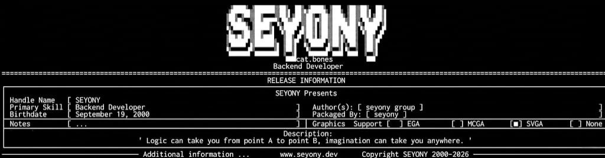

  

   

  

 

<table align="center" border="0">
  <tr>
    <td width="55%" valign="top">
      <h2>>_ RELEASE NOTES</h2>
      Я занимаюсь разработкой автоматизированных систем на Python и созданием Telegram-ботов. Сейчас основной фокус на крипто-инструментах и алгоритмическом трейдинге в сети TON.
        
      • [<b>Backend</b>] Python (Asyncio, FastAPI) 
      • [<b>Automation</b>] aiogram, ccxt, pandas 
      • [<b>Infrastructure</b>] Linux VPS, Docker, Git
    </td>
    <td width="45%" valign="center">
      
    </td>
  </tr>
</table>

## 🛠 TECH STACK

  
  
  
  
  
  

## 📊 SYSTEM STATUS
<table width="100%" border="0">
  <tr>
    <td width="50%" align="center">
      
    </td>
    <td width="50%" align="center">
      
    </td>
  </tr>
</table>

  

